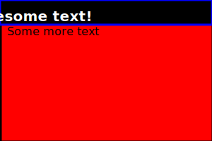

<picture>
  <source media="(min-width:650px)" srcset="https://www.w3schools.com/tags/img_pink_flowers.jpg">
  <source media="(min-width:465px)" srcset="https://www.w3schools.com/tags/img_white_flower.jpg">
  
</picture>

# misc-snippets
snippets and stuff

---

### silly2.svg

---

### silly3 markdown 

---

<h3>silly3 html</h3>

